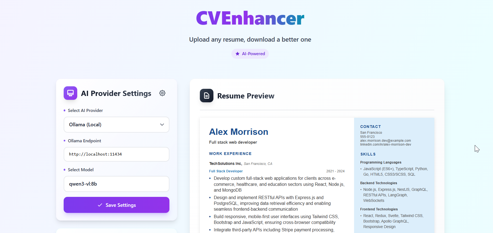

<div align="center">

# 🚀 CVEnhancer

### Upload any resume, download a better one

[](https://react.dev/)
[](https://www.typescriptlang.org/)
[](https://vitejs.dev/)
[](https://tailwindcss.com/)
[](./LICENSE)

**CVEnhancer is an AI-powered web application that transforms your resume into a professional, polished document. Upload
your resume in various formats, and let AI enhance it with optimized content, better formatting, and professional
presentation.**

[Features](#-features) • [Installation](#-installation) • [Usage](#-usage) • [Documentation](#-table-of-contents)

</div>

<div align="center">



</div>

---

## 🚀 Quick Start

```bash
# 1. Clone the repository
git clone https://github.com/IliyaBrook/CVEnhancer.git
cd CVEnhancer

# 2. Install dependencies
npm install

# 3. Set up environment
cp .env.example .env
# Edit .env with your AI provider API key

# 4. Start the development server
npm run dev

# 5. Open http://localhost:3000
```

**That's it!** Upload your resume, select an AI provider, and watch it transform.

---

## 📋 Table of Contents

- [✨ Features](#-features)
- [🛠️ Technologies Used](#️-technologies-used)
- [⚙️ Installation](#️-installation)
- [🎯 Usage](#-usage)
- [🔒 Security Notice](#-security-notice)
- [⚙️ Resume Settings](#️-resume-settings)
- [💻 Development](#-development)
- [🤝 Contributing](#-contributing)
- [📄 License](#-license)

---

## ✨ Features

### 🎯 Core Functionality

- 📄 **Multi-Format Support**: Upload resumes in PDF, DOCX, or TXT formats
- 🤖 **AI-Powered Enhancement**: Leverage OpenAI GPT, Anthropic Claude, or local Ollama models
- ⚡ **Real-time Preview**: See your enhanced resume instantly in a modern, professional layout
- 💾 **Multiple Export Formats**: Download as PDF or DOCX with professional formatting
- 🔄 **Persistent Settings**: All configurations saved to browser localStorage

### 🤖 AI Provider Options

| Provider   | Models                | Privacy        |
|------------|-----------------------|----------------|
| **OpenAI** | GPT-4, GPT-3.5        | Cloud-based    |
| **Claude** | Sonnet, Opus, Haiku   | Cloud-based    |
| **Ollama** | Llama, Mistral, Gemma | **100% Local** |

### 🎨 Customization Options

- **Experience Settings**
	- Configure maximum number of jobs to display
	- Set bullet points per job (with customizable length limits)
	- Choose metrics level (low, moderate, high)
	- Require action verbs in descriptions
	- Avoid duplicate points across experiences
	- Exclude specific job titles

- **Skills Organization**
	- Set categories limit
	- Configure skills per category
	- Automatic categorization and prioritization

- **Education Configuration**
	- Control maximum number of education entries
	- Toggle date visibility
	- Exclude specific education items

---

## 🛠️ Technologies Used

### Frontend Stack

- **React 19** - Modern UI library with latest features
- **TypeScript** - Type-safe JavaScript development
- **Vite 7** - Lightning-fast build tool and dev server
- **Tailwind CSS 3.4** - Utility-first CSS framework

### AI Integration

- **@anthropic-ai/sdk** - Official Anthropic Claude SDK
- **openai** - Official OpenAI API client
- **Ollama** - Local LLM inference (via REST API)

### Document Processing

- **@react-pdf/renderer** - React-based PDF generation
- **jsPDF** - Client-side PDF creation library
- **pdfjs-dist** - PDF parsing and text extraction
- **mammoth** - DOCX file parsing
- **html2canvas** - HTML to canvas/image conversion

### Development Tools

- **ESLint** - Code linting
- **Prettier** - Code formatting
- **TypeScript** - Static type checking

---

## ⚙️ Installation

### Prerequisites

- **Node.js 18+** and npm/yarn/pnpm
- **AI API Key** (for OpenAI or Claude) OR **Ollama installed locally**

### Quick Start

1. **Clone the repository:**

```bash
git clone https://github.com/IliyaBrook/CVEnhancer.git
cd CVEnhancer
```

2. **Install dependencies:**

```bash
npm install
# or
yarn install
# or
pnpm install
```

3. **Configure environment variables:**

```bash
cp .env.example .env
```

Edit `.env` file with your preferred settings (see [Environment Configuration](#environment-configuration) below).

4. **Start the development server:**

```bash
npm run dev
# or
yarn dev
# or
pnpm dev
```

5. **Open your browser:**

```
http://localhost:3000
```

The application will be available at port **3000** as configured in `vite.config.ts`.

---

## 🔧 Environment Configuration

### Setting Up Environment Variables

CVEnhancer uses environment variables to configure AI model parameters. These settings control the behavior and output
quality of each AI provider.

1. Copy the example environment file:

```bash
cp .env.example .env
```

2. Edit the `.env` file with your preferred settings.

### Environment Variables Reference

#### OpenAI Configuration

```bash
# OpenAI GPT Model Parameters
VITE_OPENAI_TEMPERATURE=0.7           # Creativity level (0.0-2.0). Higher = more creative
VITE_OPENAI_TOP_P=0.8                 # Nucleus sampling (0.0-1.0). Controls diversity
VITE_OPENAI_MAX_TOKENS=8192           # Maximum tokens in response
VITE_OPENAI_FREQUENCY_PENALTY=0.5     # Reduces repetition (0.0-2.0)
VITE_OPENAI_PRESENCE_PENALTY=1.0      # Encourages topic diversity (0.0-2.0)
```

**Explanation:**

- `TEMPERATURE`: Controls randomness. Lower values (0.3-0.5) = more focused/deterministic. Higher values (0.8-1.0) =
  more creative/varied.
- `TOP_P`: Alternative to temperature. Lower = more focused on likely tokens.
- `MAX_TOKENS`: Maximum length of the AI response.
- `FREQUENCY_PENALTY`: Penalizes tokens based on frequency in the text. Reduces repetitive phrases.
- `PRESENCE_PENALTY`: Penalizes tokens based on whether they've appeared. Encourages new topics.

#### Anthropic Claude Configuration

```bash
# Claude Model Parameters
VITE_CLAUDE_TEMPERATURE=0.7           # Creativity level (0.0-1.0)
VITE_CLAUDE_MAX_TOKENS=8192           # Maximum tokens in response
VITE_CLAUDE_TOP_P=0.8                 # Nucleus sampling (0.0-1.0)
VITE_CLAUDE_TOP_K=20                  # Limits vocabulary to top K tokens
```

**Explanation:**

- `TEMPERATURE`: Similar to OpenAI but range is 0.0-1.0
- `TOP_K`: Limits the model to consider only the top K most likely tokens at each step. Lower values = more focused
  output.

#### Ollama Configuration

```bash
# Ollama Local Model Parameters
VITE_OLLAMA_TEMPERATURE=0.3           # Creativity level (0.0-2.0)
VITE_OLLAMA_MAX_TOKENS=8192           # Maximum tokens in response
VITE_OLLAMA_TOP_OP=0.9                # Nucleus sampling (top_p)
VITE_OLLAMA_TOP_K=20                  # Vocabulary limitation
VITE_OLLAMA_REPEAT_PENALTY=1.1        # Penalizes repetition (1.0 = no penalty)
VITE_OLLAMA_PRESENCE_PENALTY=1.5      # Encourages topic diversity
```

**Explanation:**

- `REPEAT_PENALTY`: Values > 1.0 discourage repetition. Higher values = stronger penalty.
- `PRESENCE_PENALTY`: Similar to OpenAI, encourages the model to explore new topics.

#### Debug Mode

```bash
# Debugging
VITE_DEBUG=false                      # Set to 'true' to enable debug mode
```

**Debug Mode Features:**

When `VITE_DEBUG=true`, the application enters development mode with the following capabilities:

1. **Instant Preview json Data**
	- Automatically loads sample resume data from `src/json_cv_data/json_files/resumeData.json`
	- Bypasses AI API calls entirely - no API keys needed
	- Instantly displays resume preview without file upload
	- Perfect for UI/UX development and testing

2. **Console Logging for AI Responses**
	- Every AI-generated response is logged to browser console
	- Located in `src/App.tsx:52-53`
	- Format: `console.log('=== Generated Resume Data ===')` followed by the full JSON object
	- Use browser DevTools (F12) → Console tab to view and copy

3. **Custom Test Data Workflow**
   
   **To create your own test data:**
   
   a. **Generate a resume with AI** (disable debug mode first)
   b. **Copy the console output** - The entire JSON object from browser console
   c. **Create a private JSON file**: `src/json_cv_data/json_files/[filename]_private.json`
   d. **Paste the JSON data** into your new file
   e. **Edit manually** - Modify any fields you want to test (name, experience, skills, etc.)
   f. **Import in resumeData.ts**:
   ```typescript
   // src/json_cv_data/resumeData.ts
   import fakeResumeDataExample from './json_data/resumeData.json';
   import myCustomData from './json_data/myResume_private.json'; // Your file
   
   export const resumeData: ResumeData = myCustomData; // Use your data
   ```
   **Enable debug mode** and test your changes
   
   **Why `*_private.json`?**
	
	- Files matching `*_private.json` are gitignored
	- Prevents accidentally committing personal resume data
	- Safe for testing with real information

4. **Use Cases for Debug Mode**
	
	- **Frontend Development**: Iterate on UI without API costs
	- **PDF Layout Testing**: Test different resume lengths and formats
	- **Edge Case Testing**: Create resumes with unusual data (very long names, many jobs, etc.)
	- **Localization Testing**: Test with different languages or character sets
	- **Performance Testing**: Measure rendering time with large datasets
	- **Demo Presentations**: Show the app without needing API keys

### Recommended Settings by Use Case

#### For Professional Resumes (Recommended)

```bash
VITE_OPENAI_TEMPERATURE=0.7
VITE_CLAUDE_TEMPERATURE=0.7
VITE_OLLAMA_TEMPERATURE=0.3
```

#### For Creative Industries

```bash
VITE_OPENAI_TEMPERATURE=0.9
VITE_CLAUDE_TEMPERATURE=0.8
```

#### For Technical/Engineering Roles

```bash
VITE_OPENAI_TEMPERATURE=0.5
VITE_CLAUDE_TEMPERATURE=0.5
```

---

## 🎯 Usage

### Quick Start Guide

1. **Configure AI Provider**
	- Select your preferred AI provider from the dropdown (OpenAI, Claude, or Ollama)
	- Enter your API key (not required for Ollama)
	- Optionally specify a model name (defaults to recommended model)
	- Click "Save Settings"

2. **Upload Your Resume**
	- Click the upload area or drag and drop your resume file
	- Supported formats: PDF, DOCX, TXT
	- The file will be automatically parsed

3. **AI Enhancement**
	- The application automatically sends your resume to the selected AI provider
	- Processing typically takes 10-30 seconds depending on the provider and resume length
	- Watch the real-time preview as it's being processed

4. **Customize Settings** (Optional)
	- Click the settings gear icon (⚙️) next to "AI Provider Settings"
	- Adjust experience, skills, and education parameters
	- Changes are immediately saved to browser storage

5. **Export Your Enhanced Resume**
	- Click "Download as PDF" for a print-ready document
	- Or click "Download as DOCX" for an editable Word document

---

## 🔒 Security Notice

### API Keys Storage

**IMPORTANT:** CVEnhancer stores your AI provider settings, including API keys, in your browser's **localStorage**.

#### What This Means:

- ✅ **Your API keys are stored locally** in your browser, not on any server
- ✅ **No data is transmitted to CVEnhancer servers** - all processing happens client-side or directly with AI providers
- ⚠️ **API keys are stored in plain text** in localStorage
- ⚠️ **Anyone with access to your browser** can potentially view stored keys
- ⚠️ **Keys persist** until you manually clear them or clear browser data

#### Best Practices:

1. **Do not use this application on shared or public computers**
2. **Clear your API keys after use** by changing providers or clearing browser localStorage
3. **Use API keys with usage limits** to prevent abuse if compromised
4. **For production deployment**, consider implementing server-side API key management
5. **Regularly rotate your API keys** for better security

---

## 🤖 AI Provider Setup

### OpenAI

1. **Get your API Key:**
	- Visit [OpenAI Platform](https://platform.openai.com/api-keys)
	- Sign in or create an account
	- Navigate to "API Keys"
	- Click "Create new secret key"
	- Copy the key (starts with `sk-`)
2. **Configure in CVEnhancer:**
	- Select "OpenAI" as provider
	- Paste your API key
	- Recommended models: `gpt-4o-2024-08-06`, `gpt-4`, `gpt-3.5-turbo`

### Anthropic Claude

1. **Get your API Key:**
	- Visit [Anthropic Console](https://console.anthropic.com/settings/keys)
	- Sign in or create an account
	- Navigate to "API Keys"
	- Click "Create Key"
	- Copy the key (starts with `sk-ant-`)
2. **Configure in CVEnhancer:**
	- Select "Claude (Anthropic)" as provider
	- Paste your API key
	- Recommended models: `claude-4-5`, `claude-3-opus-20240229`, `claude-3-haiku-20240307`

### Ollama (Local)

1. **Install Ollama:**
	- Visit [Ollama.ai](https://ollama.ai/)
	- Download for your operating system
	- Install and start Ollama

2. **Pull a Model:**

```bash
# Recommended models with vision for better results:
ollama pull qwen3-vl:8b
ollama pull qwen3-vl:4b
```

3. **Configure in CVEnhancer:**
	- Select "Ollama (Local)" as provider
	- Endpoint: `http://localhost:11434` (default)
	- Select your downloaded model from the dropdown
	- No API key required

4. **Benefits:**
	- ✅ Completely free
	- ✅ Privacy - no data leaves your machine
	- ✅ No internet required (after model download)
	- ⚠️ Requires GPU for good performance
	- ⚠️ Quality may vary compared to GPT-4/Claude

---

## ⚙️ Resume Settings

The Resume Settings modal (accessible via ⚙️ button) allows you to customize how your resume is enhanced.

### Experience Settings

Located in `src/components/ResumeSettingsModal.tsx:98-257`

| Setting                    | Description                                          | Default            | Range/Options       |
|----------------------------|------------------------------------------------------|--------------------|---------------------|
| **Max Jobs**               | Maximum number of work experiences to include        | 2                  | 1-10                |
| **Bullet Points per Job**  | Number of achievement points per position            | 5                  | 1-10                |
| **Max Bullet Length**      | Character limit for each bullet point                | None               | Any number or blank |
| **Require Action Verbs**   | Ensures each bullet starts with a strong action verb | ✓ Enabled          | Checkbox            |
| **Metrics Level**          | Emphasis on quantifiable achievements                | Moderate           | Low, Moderate, High |
| **Avoid Duplicate Points** | Prevents similar achievements across roles           | ✓ Enabled          | Checkbox            |
| **Exclude Jobs**           | List of job titles to omit                           | ["JOB TO EXCLUDE"] | Text list           |

## 💻 Development

### Available Scripts

```bash
# Start development server (runs on http://localhost:3000)
yarn dev
yarn build
yarn lint
yarn format:check
yarn preview
```

### Key Files Explained

#### `src/services/aiServiceFactory.ts`

The heart of the AI integration. Handles:

- Resume enhancement prompts for each AI provider
- API calls with retry logic
- JSON extraction from AI responses
- Enforcement of resume constraints (max jobs, bullet points, etc.)
- Provider-specific implementations:
	- OpenAI: Uses structured output with JSON schema
	- Claude: Uses prompt prefilling for reliable JSON
	- Ollama: Two-step process (personal info + experience separately)

#### `src/components/ResumeSettingsModal.tsx`

Complete settings interface with:

- Experience configuration (jobs, bullet points, metrics)
- Skills configuration (categories, skills per category)
- Education configuration (entries, date visibility)
- Exclude lists for jobs and education
- Real-time saving to localStorage

#### `src/utils/storage.ts`

localStorage abstraction layer:

- `saveConfig()` / `loadConfig()` - AI provider settings
- `saveResumeConfig()` / `loadResumeConfig()` - Resume enhancement settings
- Error handling for localStorage access issues

#### `src/hooks/useAIConfig.ts`

React hook for AI configuration state management:

- Loads configuration from localStorage on mount
- Provides `updateConfig()` to save changes
- Automatically syncs with localStorage

#### `src/config/env.ts`

Environment variable parsing with:

- Type-safe getters (`getEnvString`, `getEnvNumber`, `getEnvBoolean`)
- Default values for optional variables
- Validation with helpful error messages
- Exports for OpenAI, Claude, and Ollama options

#### `src/json_cv_data/resumeData.ts`

Debug mode data management:

- Imports sample resume data from JSON files
- Default: `resumeData.json` (example resume)
- Can be switched to custom `*_private.json` files for testing
- Used when `VITE_DEBUG=true` to bypass AI processing
- Enables rapid UI iteration without API costs

### Development Tips

1. **Debug Mode**: Set `VITE_DEBUG=true` in `.env` for rapid development
	- Loads fake resume data from `src/json_cv_data/json_files/resumeData.json`
	- Skips file upload and AI processing
	- No API keys required
	- **Pro Tip**: Copy AI-generated JSON from console, save as `*_private.json`, and import in `resumeData.ts` for
	  testing custom data

2. **Testing Different Providers**: Create multiple API keys with usage limits
	- Test each provider's output quality
	- Compare processing times
	- Use debug mode to test UI changes without consuming API credits

3. **Customizing Default Settings**: Edit `src/config/resume-ai-config.json`
	- Changes affect all new users
	- User settings in localStorage override defaults
	- Test with different configurations using debug mode

4. **Adding New AI Providers**: Modify `src/services/aiServiceFactory.ts`
	- Add provider to `AIProvider` enum in `src/types/ai.types.ts`
	- Implement `enhanceWith[Provider]()` function
	- Add to switch statement in `enhanceResume()`
	- Add environment variables in `.env.example` and `src/config/env.ts`

5. **Styling Changes**: This project uses Tailwind CSS
	- All styling is utility-based
	- Custom colors defined in `tailwind.config.js`
	- Global styles in `src/index.css`
	- Use debug mode to see changes instantly without AI calls

6. **Console Debugging**: AI responses are always logged
	- Check browser console (F12 → Console) for `=== Generated Resume Data ===`
	- Useful for debugging JSON structure issues
	- Located in `src/App.tsx:52-53`

---

## 🤝 Contributing

Contributions are welcome! Whether you're fixing bugs, adding features, or improving documentation, your help is
appreciated.

### How to Contribute

1. **Fork the repository**
2. **Create a feature branch**: `git checkout -b feature/amazing-feature`
3. **Make your changes**
4. **Test thoroughly**: Ensure all lint checks pass
   ```bash
   yarn run lint
   yarn run format:check
   ```
5. **Commit your changes**: `git commit -m 'Add amazing feature'`
6. **Push to your branch**: `git push origin feature/amazing-feature`
7. **Open a Pull Request**

### Contribution Guidelines

- Follow the existing code style (enforced by ESLint and Prettier)
- Write clear, descriptive commit messages
- Update documentation for any user-facing changes
- Test with multiple AI providers if possible
- For major changes, open an issue first to discuss the approach

### Areas for Contribution

- 🐛 **Bug fixes** - Report or fix bugs
- ✨ **New features** - Additional AI providers, export formats, etc.
- 📝 **Documentation** - Improve README, add code comments
- 🎨 **UI/UX improvements** - Better design, accessibility
- 🔒 **Security** - Implement encrypted storage for API keys
- 🧪 **Testing** - Add unit tests and integration tests
- 🌍 **Internationalization** - Multi-language support

---

## 👤 Author

**Iliya Brook**

- 📧 Email: [iliyabrook1987@gmail.com](mailto:iliyabrook1987@gmail.com)
- 🐙 GitHub: [@IliyaBrook](https://github.com/IliyaBrook)
- 💼 Portfolio: Check out my other projects on GitHub

### About the Project

CVEnhancer was created to help job seekers leverage AI technology to improve their resumes. The goal is to make
professional resume enhancement accessible to everyone, whether they have an OpenAI API key or prefer to use free, local
AI models with Ollama.

If you find this project helpful, please consider:

- ⭐ Starring the repository
- 🐛 Reporting bugs and issues
- 💡 Suggesting new features
- 🤝 Contributing code or documentation

---

## 📄 License

This project is licensed under a **custom MIT License with Commercial Use Restriction**.

### License Summary

✅ **Permitted for Non-Commercial Use:**

- Personal resume enhancement
- Educational purposes
- Open-source projects
- Research and development
- Portfolio demonstration

❌ **Requires Written Permission for Commercial Use:**

- Offering resume enhancement as a paid service
- Incorporating into a commercial product
- Using in a business environment that generates revenue
- Providing as part of a paid consulting service

### Getting Permission

For commercial licensing inquiries, please contact:

- **Email**: iliyabrook1987@gmail.com
- **Subject**: CVEnhancer Commercial License Request

Please include:

- Your intended use case
- Expected scale/volume
- Company/organization details (if applicable)

### Full License

See the [LICENSE](LICENSE) file for complete legal terms.

---

## 💬 Support

### Getting Help

If you encounter issues or have questions:

1. **📖 Check the Documentation**: Read this README thoroughly
2. **🔍 Search Existing Issues**: Your question might already be answered
3. **🐛 Report a Bug**: [Create a new issue](https://github.com/IliyaBrook/CVEnhancer/issues/new)
4. **💬 Contact the Author**: iliyabrook1987@gmail.com

### When Reporting Issues

Please include:

- **Environment**: OS, Node.js version, browser
- **AI Provider**: Which provider you're using (OpenAI, Claude, Ollama)
- **Steps to Reproduce**: Clear steps to recreate the issue
- **Expected vs Actual Behavior**: What should happen vs what actually happens
- **Error Messages**: Any console errors or error messages
- **Screenshots**: If applicable

---

## 🗺️ Roadmap

### Planned Features

- [ ] **Cover letter generation** - AI-powered cover letters
- [ ] **Job description matching** - Tailor resume to specific job postings
- [ ] **Resume templates** - Multiple visual templates to choose from

### ⭐ If you find this project helpful, please consider starring it!

**Made with ❤️ using React, TypeScript, and AI**

*Transform your resume, transform your career*

---

[](https://github.com/IliyaBrook/CVEnhancer/stargazers)
[](https://github.com/IliyaBrook/CVEnhancer/network/members)
[](https://github.com/IliyaBrook/CVEnhancer/issues)